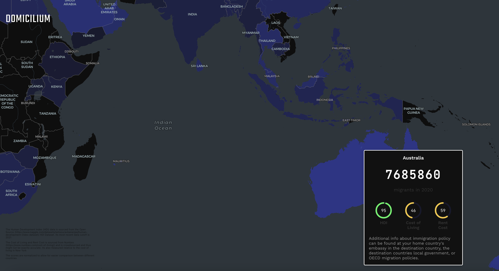

# Immigration Helper Map
A tool designed to help immigrants work out where the best place to call *home* is. 

It aggregates data from multiple sources to create a map view in Deck.GL that allows the user to easily see countries with good quality of life indices.

Highlighting countries shows additional info about rent costs, grocery costs, and the HDI levels in that particular country, along with a count of the number of immigrants that have moved there.

## Preview

